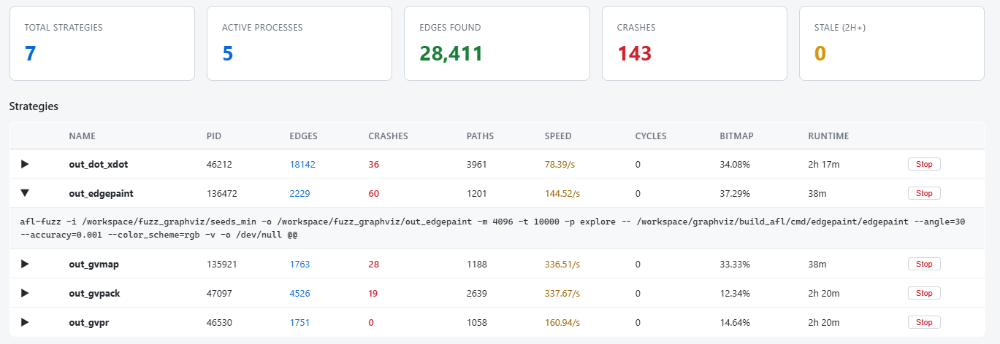

# Vulnerability Discovery Pipeline

基于 Claude Agent SDK 的自动化漏洞发现流水线。针对 **C/C++** 开源项目，利用 AFL++ 进行覆盖引导的模糊测试，自动完成从程序分析到漏洞报告的全流程。

> **Demo 版本** — 当前实现针对 C/C++ + AFL++ 的完整链路。后续将支持更多语言和 fuzzer（libFuzzer、Jazzer 等）。

## Fuzz 流水线

```
Phase 1: Program Analysis  → 分析 CLI 结构、参数依赖、调用链、漏洞路径评分
      ↓
Phase 2: Preprocess        → 编译 target（AFL++ + ASAN）、收集种子、设计策略、创建 fuzz_manifest.json
      ↓
Phase 3: Execute Fuzz      → 读取 manifest，并行启动 AFL++ 策略，实时监控覆盖率和崩溃
      ↓
Phase 4: Issue Generator   → 崩溃复现、ASAN 去重、生成 GitHub Issue 报告
      ↓
Phase 5: Summary           → 查看本次 fuzz 活动的完整报告汇总
```

每个阶段由 Claude Code agent 通过预定义的 skill 自主执行，中间结果持久化到 `outputs/<project>/`，支持断点续跑。

## 快速开始

### 1. 启动 AFL++ 容器

```bash
cd auto_fuzz
docker compose up -d
```

### 2. 一键部署

```bash
bash deploy.sh
```

脚本会自动完成：检查 Claude Code 环境 → 安装 skills → 安装 Python 依赖 → 启动 Web UI。

### 3. 手动启动

```bash
pip install -e .
python -m pipeline.webui
```

浏览器打开 `http://localhost:8765`，将待测项目拷贝到auto_fuzz同目录下，然后选择目标项目后按阶段执行即可。

## Web UI 功能

### 5 阶段流水线控制

| 阶段 | 按钮 | 功能 |
|------|------|------|
| Phase 1 | Analyze | 分析 CLI 结构、参数依赖、调用链 |
| Phase 2 | Prep | 编译 target + 生成种子 + 创建 `fuzz_manifest.json` |
| Phase 3 | Fuzz | 读取 manifest，启动用户选中的 AFL++ 策略 |
| Phase 4 | Issues | 崩溃复现 + 去重 + 生成 GitHub Issue |
| Phase 5 | Summary | 查看完整的 fuzz 活动汇总报告 |

### 策略管理

- **策略列表**：从容器读取 `fuzz_manifest.json`，以卡片形式展示每个策略的名称、优先级、漏洞评分和完整命令
- **勾选启动**：勾选需要运行的策略，点击 Phase 3 自动保存到 `fuzz_manifest_selected.json` 并启动
- **Select All**：一键全选/取消
- **追加模式**：Phase 3 已运行时新策略追加到 manifest 后自动启动（不重复启动已在跑的）

### Reference Context

- 用户可输入或上传 `.md` 文件提供参考信息（如已知漏洞模式、需要重点测试的路径等）
- 支持 Enable 开关：勾选后才传给 Phase 3 agent 作为参考
- agent 根据参考信息，可自主决定追加新的 fuzz 策略到 manifest
- 内容持久化到 `outputs/<project>/phase3_context.txt`

### 实时监控

| 指标卡片 | 说明 |
|---------|------|
| Total Strategies | manifest 中策略总数 |
| Active Processes | 当前活跃的 afl-fuzz 进程数（按输出目录去重） |
| Edges Found | 所有策略累计边覆盖 |
| Crashes | 所有策略累计崩溃数 |
| Stale (2h+) | 超过 2 小时未增加边覆盖的策略数 |

- **策略表格**：实时显示每个策略的 PID、边数、崩溃数、路径数、执行速度、Cycle、位图覆盖率、运行时间
- **展开命令**：点击策略行可展开完整 `afl-fuzz` 命令
- **停滞标注**：2 小时未增加覆盖的策略行后显示 ⚠ 图标，悬停显示提示
- **一键终止**：每行末尾的 Stop 按钮可单独终止指定 afl-fuzz 进程
- **Stopped Strategies**：已终止的策略单独成表，记录最终状态，重启后依然保留
- **自动刷新**：每 5 秒轮询一次状态

图例：


### 活动汇总

- **Phase 5: Summary**：一键查看当前项目的完整 `SUMMARY.md` 报告
- 点击后切换到全屏阅读模式，支持表格、代码块、标题等完整 Markdown 渲染
- 切换项目或再次点击 Phase 5 退出汇总视图

### 工作空间管理

- **Clean Workspace**：一键终止所有 afl-fuzz 进程 + 清空容器 fuzz 目录 + 清空本地 output 目录
- 每次启动 Phase 2 自动清理上次的 fuzz 输出

## 项目结构

```
auto_fuzz/
├── skills/                    # 技能定义文件 (.md)
│   ├── program-analysis.md     # CLI 程序分析
│   ├── auto-fuzz.md            # Phase 2：预处理
│   ├── auto-fuzz-exec.md       # Phase 3：启动 fuzz
│   ├── crash-reporter.md       # Phase 4：崩溃复现
│   └── issue-generator.md      # Phase 4：Issue 生成
├── pipeline/                  # Python SDK 编排器
│   ├── orchestrator.py        # 流水线核心逻辑 + prompt 拼接
│   ├── webui.py               # FastAPI Web 控制中心
│   └── __init__.py
├── outputs/                   # 各项目的输出目录（自动生成）
│   └── <project>/
│       ├── fuzz_manifest.json           # 所有策略
│       ├── fuzz_manifest_selected.json  # 用户选中的策略
│       ├── fuzz_manifest_select.json    # 策略 ID 选择文件
│       ├── phase3_context.txt           # 参考上下文
│       ├── phase3_context_enabled       # 参考上下文启用标志
│       └── killed_strategies.json       # 已终止策略记录
├── docker-compose.yml         # AFL++ 容器配置
├── pyproject.toml
├── deploy.sh                  # 一键部署脚本
└── README.md
```

## 容器交互

所有 afl-fuzz 命令在 Docker 容器内执行，宿主机只需运行编排器。

```bash
# 进入容器
docker exec -it afl bash

# 查看 fuzz 状态
docker exec afl afl-stats /workspace/out_default

# 停止容器
docker compose down
```

## 部署斜杠命令

```bash
bash deploy.sh
```

或手动安装 skills：

```bash
mkdir -p ~/.claude/skills/{program-analysis,auto-fuzz,auto-fuzz-exec,crash-reporter,issue-generator}
cp skills/program-analysis.md    ~/.claude/skills/program-analysis/SKILL.md
cp skills/auto-fuzz.md           ~/.claude/skills/auto-fuzz/SKILL.md
cp skills/auto-fuzz-exec.md      ~/.claude/skills/auto-fuzz-exec/SKILL.md
cp skills/crash-reporter.md      ~/.claude/skills/crash-reporter/SKILL.md
cp skills/issue-generator.md     ~/.claude/skills/issue-generator/SKILL.md
```

安装后可在 Claude Code 中用 `/program-analysis`、`/auto-fuzz`、`/crash-reporter`、`/issue-generator` 斜杠命令触发。
